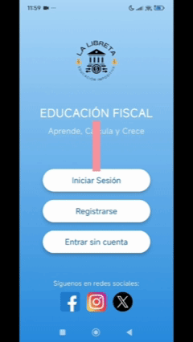

# 📱 Kotlin Mobile Demo – Educación Fiscal

Aplicación **Android** desarrollada con **Kotlin + Jetpack Compose**, orientada a la **educación fiscal** y a la **automatización de cálculos impositivos**, con arquitectura moderna, enfoque profesional y experiencia de usuario clara.

---

## 🧠 Descripción general

Esta aplicación permite a los usuarios:

- Registrarse e iniciar sesión
- Calcular impuestos de forma guiada
- Consultar el historial de cálculos realizados
- Acceder a un glosario fiscal interactivo
- Visualizar vencimientos importantes

El objetivo principal es **simplificar conceptos fiscales** y brindar una herramienta educativa accesible desde dispositivos móviles.

---

## 🏗️ Arquitectura y tecnologías

- **Lenguaje:** Kotlin
- **UI:** Jetpack Compose
- **Arquitectura:** MVVM
- **Networking:** Retrofit
- **Estado:** ViewModel + State
- **Build system:** Gradle
- **Diseño:** Material Design 3

---

## 🎥 Demo de la aplicación (GIFs)

### 🔐 Inicio de sesión

---

### 📝 Crear cuenta

---

### 🧮 Cálculo de impuestos

---

### 📊 Historial de cálculos

---

### 📚 Vencimientos y glosario

---

## 🚀 Funcionalidades principales

- Registro e inicio de sesión de usuarios
- Cálculo de impuestos paso a paso
- Historial persistente de cálculos
- Glosario fiscal explicativo
- Interfaz moderna y responsive
- Validaciones y feedback visual

---

## 📂 Estructura del proyecto
